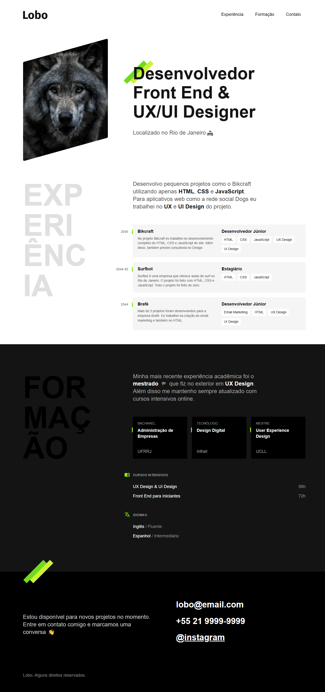

# 💼 Portfólio de Lobo

Bem-vindo(a) ao meu cantinho digital! Este repositório abriga o código do meu portfólio Lobo do curso de HTML e CSS da Origamid — onde criatividade, código limpo e café forte se encontram ☕💻

## 🚀 Sobre o Projeto

Este portfólio foi criado com o objetivo de colocar em prática o conhecimento obtido durante o curso.

### Principais Funcionalidades:
- 📱 Totalmente responsivo (mobile-first!)
- 🧩 Seções de experiência e formaçao.

## 🛠️ Tecnologias Utilizadas
- HTML5 e CSS3

## ⚙️ Como Rodar Localmente

```bash
git clone https://github.com/rarissax/Projeto-Portfolio-HTML-CSS.git
cd Projeto-Portfolio-HTML-CSS-master
⚠️ Este projeto requer o uso do Live Server para funcionar corretamente.
 - Abra o arquivo `index.html` com a extensão Live Server no VS Code.
```

## 📦 Layouts

